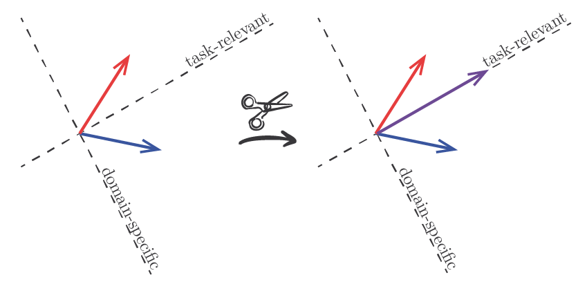

# Domain Generalization via Gradient Surgery
This repository contains the source code corresponding to the paper "Domain Generalization via Gradient Surgery" (ICCV 2021). To learn more about our work, please visit this link: https://arxiv.org/abs/2108.01621

<p align="center"></p>

## Instructions
This project uses Python 3.6.9 and PyTorch 1.8.1.
### Data:
1. Download [PACS](https://drive.google.com/uc?id=1JFr8f805nMUelQWWmfnJR3y4_SYoN5Pd) (Li et al., 2017), [VLCS](https://drive.google.com/uc?id=1skwblH1_okBwxWxmRsp9_qi15hyPpxg8) (Fang et al., 2013) and [Office-Home](https://drive.google.com/uc?id=0B81rNlvomiwed0V1YUxQdC1uOTg) (Venkateswara et al., 2017) datasets.
2. Put the data of each dataset into a folder named `orig`, inside a parent folder named `data`. For example: `/path/to/DGvGS/data/orig/PACS`.
3. Run the `run_pre.sh` script to resize the images and generate the training, validation and test splits.


### Python environment:
1. Create and activate virtual environment: 1) `python -m venv /path/to/myenv`, 2) `source /path/to/myenv/bin/activate`
2. Install required packages: `pip install -r /path/to/DGvGS/requirements.txt`

### Simulations:
To run the simulations across all datasets (PACS, VLCS and Office-Home) and methods (Deep-All, Agr-Sum, Agr-Rand and PCGrad), execute the `run_all.sh` script.

Otherwise, if you want to run a particular combination of dataset and method, use the `train.py` script. For example, the following instruction: 
```
python train_all.py --data_dir=data/pre --output_dir=result/train_all --dataset=PACS --method=deep-all
```
will run Deep-All on PACS and save the results in `/path/to/DGvGS/result/train_all`.

## Reference
- Mansilla, L., Echeveste, R., Milone, D. H., & Ferrante, E. (2021). Domain generalization via gradient surgery. In Proceedings of the IEEE/CVF International Conference on Computer Vision (pp. 6630-6638).

## License
[MIT](https://choosealicense.com/licenses/mit/)
