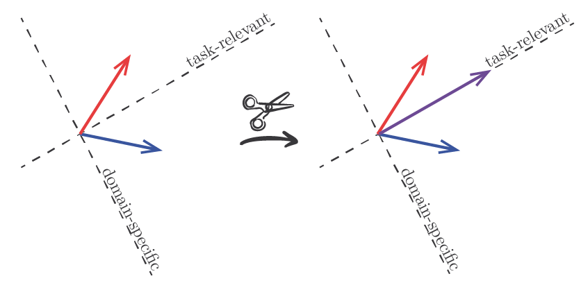

# Domain Generalization via Gradient Surgery
This repository contains the source code corresponding to the paper "Domain Generalization via Gradient Surgery" (ICCV 2021). You can check out our paper here: https://arxiv.org/abs/2108.01621.

<p align="center"></p>

## Instructions
This project uses Python 3.8.10 and PyTorch 1.10.0.

### Data:
1. Download the [PACS](https://drive.google.com/uc?id=1JFr8f805nMUelQWWmfnJR3y4_SYoN5Pd) (Li et al., 2017), [VLCS](https://drive.google.com/uc?id=1skwblH1_okBwxWxmRsp9_qi15hyPpxg8) (Fang et al., 2013) and [Office-Home](https://drive.google.com/uc?id=0B81rNlvomiwed0V1YUxQdC1uOTg) (Venkateswara et al., 2017) datasets and put them in `data/raw/`.
2. Resize images and generate training, validation and test splits. Run `./00_prepare_data.sh` after installing the project environment (instructions below).


### Project environment:
1. Create and activate virtual environment: 1) `python3 -m venv env`, 2) `source env/bin/activate`
2. Install required packages: `pip install -r requirements.txt`
3. Install project modules (src): `pip install -e .`

### Simulations:

To run simulations across all datasets (PACS, VLCS and Office-Home) and methods (Deep-All, Agr-Sum, Agr-Rand and PCGrad), execute `./01_run_trials.sh`.

If you want to run a particular combination of dataset and method, use the `train_model.py` script. For example, the following instruction: 
```
python scripts/train_model.py \
    --data_dir=data/processed \
    --results_dir=results/train \
    --dataset=PACS \
    --method=deep-all
```
will run Deep-All on PACS and save the results in `results/train`.

## Reference
- Mansilla, L., Echeveste, R., Milone, D. H., & Ferrante, E. (2021). Domain generalization via gradient surgery. In Proceedings of the IEEE/CVF International Conference on Computer Vision (pp. 6630-6638).

## License
[MIT](https://choosealicense.com/licenses/mit/)
